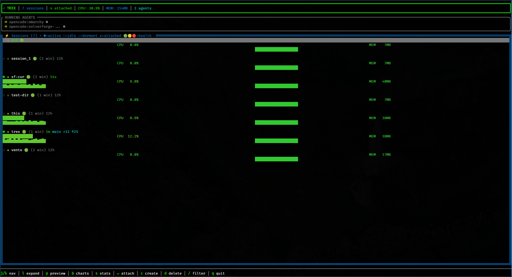

# trex

A tmux session manager with real-time system monitoring and AI agent tracking.
Built in Rust with [ratatui](https://github.com/ratatui-org/ratatui). Designed for [Omarchy](https://github.com/basecamp/omarchy).



## What It Does

trex replaces the tmux session workflow -- listing, switching, creating, killing -- with an interactive TUI that shows you what's actually happening inside each session.

**Session management.** Fuzzy-find sessions by name or path. Expand any session to see its windows. Preview live pane content before attaching. Create sessions from a directory picker with configurable scan depth. Smart preselection matches your current working directory. Git status (branch, dirty count, ahead/behind) displayed inline.

**System monitoring.** Live per-session CPU and memory usage with color-coded gauges and sparkline history charts. Health scores (0-100) combine CPU, memory, and activity into a single indicator per session. A bar chart view (`b`) ranks sessions by resource consumption. A stats overlay (`s`) gives you the full picture: top consumers, health summary, and activity timeline.

**AI agent tracking.** Detects running AI coding agents -- Claude, OpenCode, Zoyd, OpenClaw -- by scanning `/proc`. Shows activity state (running/waiting), maps agents to their tmux sessions, and displays parent-child process relationships. Navigate directly to any agent's session from the agent panel.

## Omarchy Integration

trex reads your current Omarchy theme from `~/.config/omarchy/current/theme/colors.toml` and adapts its entire color scheme automatically. No configuration needed.

**Theme mapping:**

| Omarchy color | trex usage |
|---------------|------------|
| `accent` | Borders, selected items, branding |
| `color1` | Error indicators |
| `color2` | Active/success indicators |
| `color3` | Warning/idle indicators |
| `color4` | Info, memory display |
| `color8` | Dimmed text |
| `foreground` | Primary text |
| `selection_background` | Highlight |

The T-Rex ASCII background generates a gradient from your accent color. If Omarchy is not detected, trex falls back to a default green theme.

**Recommended keybinding.** Add to `~/.config/hypr/bindings.conf`:

```conf
bindd = SUPER SHIFT, T, Tmux Manager, exec, trex
```

This follows Omarchy's `SUPER SHIFT + letter` pattern for application launchers.

**Bash keybinding.** Add to your `.bashrc` for terminal access:

```bash
bind '"\C-t": "\C-a\C-ktrex\n"'
```

## Installation

### From Source

Requires the Rust toolchain (1.85+, edition 2024).

```bash
git clone https://github.com/blackopsrepl/trex.git
cd trex
make install-user    # installs to ~/.cargo/bin
```

Or system-wide:

```bash
sudo make install    # installs to /usr/local/bin
```

### Prebuilt Binaries

Static Linux binaries (x86_64 and aarch64) are published on GitHub releases:

```bash
curl -fsSL https://github.com/blackopsrepl/trex/releases/latest/download/trex-linux-x86_64.tar.gz \
  | tar -xzf - -C ~/.cargo/bin
```

### Static Build

Build a fully static binary with musl:

```bash
make static          # x86_64
make static-arm      # aarch64
```

## Usage

Run `trex` from outside tmux. tmux must be installed and in your PATH.

```bash
trex
```

### Keybindings

**Normal mode**

| Key | Action |
|-----|--------|
| `j` / `Down` | Move down (agents to sessions) |
| `k` / `Up` | Move up (sessions to agents) |
| `g` / `Home` | First item |
| `G` / `End` | Last item |
| `Enter` | Attach to session or agent's session |
| `l` / `Right` | Expand session windows |
| `p` | Toggle live preview |
| `b` | Toggle bar chart view |
| `s` | Toggle stats overlay |
| `c` | Create new session |
| `d` | Delete session |
| `D` | Delete all sessions |
| `x` | Detach clients from session |
| `X` | Detach all clients |
| `/` | Filter mode |
| `q` / `Esc` / `Ctrl-t` | Quit |

**Expanded session mode** (window list)

| Key | Action |
|-----|--------|
| `j` / `k` | Navigate windows |
| `Enter` | Attach to window |
| `h` / `Left` / `Esc` | Collapse back |

**Filter mode**

| Key | Action |
|-----|--------|
| Type | Fuzzy filter sessions |
| `Backspace` | Delete character |
| `Esc` | Exit filter |

**Directory selection** (creating sessions)

| Key | Action |
|-----|--------|
| `j` / `k` | Navigate directories |
| `Enter` | Create session in directory |
| `+` / `-` | Adjust scan depth (1-6) |
| `Tab` | Autocomplete from selection |
| Type | Fuzzy filter directories |
| `Esc` | Cancel |

**Bar chart view**

| Key | Action |
|-----|--------|
| `b` / `Esc` | Return to normal view |

**Stats overlay**

| Key | Action |
|-----|--------|
| `s` / `Esc` | Close overlay |

## Architecture

```
src/
  main.rs           Entry point, TTY handling, action dispatch
  theme.rs          Omarchy theme loading and fallback
  process.rs        AI agent detection via /proc scanning
  sysinfo.rs        Per-session CPU/memory stats from /proc
  health.rs         Session health scoring algorithm
  git.rs            Git status detection (branch, dirty, ahead/behind)
  directory.rs      Directory discovery and session naming
  tmux/
    commands.rs     Tmux CLI wrapper (sessions, windows, panes)
    session.rs      Session struct, activity levels, CWD matching
    parser.rs       Output parsing
    window.rs       Window struct and parsing
  tui/
    mod.rs          Event loop with tiered refresh (100ms/1s/2s)
    events.rs       Key event dispatch across 7 modes
    app/            Application state (agent, directory, filter, naming,
                    preview, session, window submodules)
    ui/             Rendering (normal, expanded, directory, naming,
                    barchart, stats_overlay, background)
```

## Dependencies

| Crate | Purpose |
|-------|---------|
| [ratatui](https://github.com/ratatui-org/ratatui) | Terminal UI framework |
| [crossterm](https://github.com/crossterm-rs/crossterm) | Terminal backend |
| [nucleo](https://github.com/helix-editor/nucleo) | Fuzzy matching (from Helix) |
| [anyhow](https://github.com/dtolnay/anyhow) | Error handling |
| [toml](https://github.com/toml-rs/toml) + [serde](https://serde.rs) | Theme config parsing |
| [which](https://github.com/harryfei/which-rs) | tmux binary lookup |
| [libc](https://github.com/rust-lang/libc) | TTY handling |

## Development

```
make              Build release binary
make static       Static x86_64 binary (musl)
make static-arm   Static aarch64 binary (musl)
make test         Run tests
make lint         Run clippy
make fmt          Format code
make check        Type-check without building
make clean        Remove build artifacts
make help         Show all targets
```

## License

ISC -- see [LICENSE](LICENSE).
