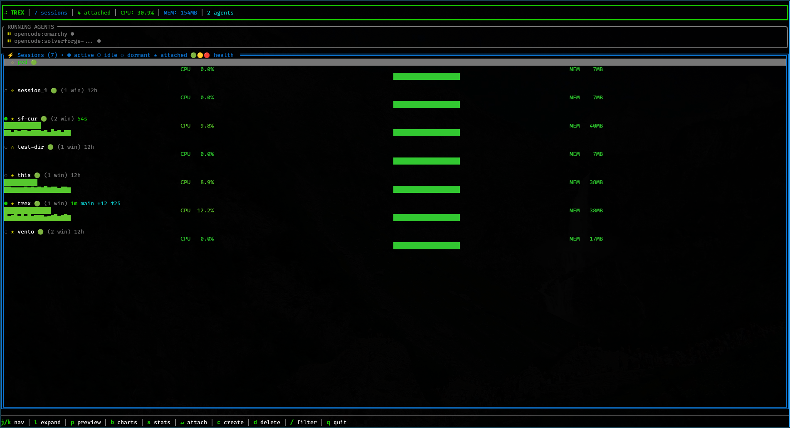

[](https://github.com/blackopsrepl/trex/actions/workflows/ci.yml)
[](https://crates.io/crates/trex-cli)
[](LICENSE)

# trex

<p align="center">
  
</p>

A tmux session manager with real-time system monitoring and AI agent tracking.
Built in Rust with [ratatui](https://github.com/ratatui-org/ratatui). Designed for [Omarchy](https://github.com/basecamp/omarchy).



## What It Does

trex replaces the tmux session workflow -- listing, switching, creating, killing -- with an interactive TUI that shows you what's actually happening inside each session.

**Session management.** Fuzzy-find sessions by name or path. Expand any session to see its windows. Preview live pane content before attaching. Create sessions from a directory picker with configurable scan depth and template selection. Smart preselection matches your current working directory. Git status (branch, dirty count, ahead/behind) displayed inline.

**System monitoring.** Live per-session CPU and memory usage with color-coded gauges and sparkline history charts. Health scores (0-100) combine CPU, memory, and activity into a single indicator per session. A bar chart view (`b`) ranks sessions by resource consumption. A stats overlay (`s`) gives you the full picture: top consumers, health summary, and activity timeline.

**AI agent tracking.** Detects running AI coding agents -- Claude, Codex, Gemini, OpenCode, Zoyd, OpenClaw -- by scanning `/proc`. Shows activity state (running/waiting), maps agents to their tmux sessions, and displays parent-child process relationships. Navigate directly to any agent's session from the agent panel.

**Snapshot backend.** `trex snapshot --json` emits the same session, agent, health, git, and system data as structured JSON. This is the read-only backend contract used by companion status-bar and desktop integrations. `trex --help` and `trex --version` are also non-interactive, so they work from scripts and non-TTY shells.

## Omarchy Integration

trex reads your current Omarchy theme from `~/.config/omarchy/current/theme/colors.toml` and adapts its entire color scheme automatically. No configuration needed.

**Theme mapping:**

| Omarchy color | trex usage |
|---------------|------------|
| `accent` | Borders, selected items, branding |
| `color1` | Error indicators |
| `color2` | Active/success indicators |
| `color3` | Warning/idle indicators |
| `color4` | Info, memory display |
| `color8` | Dimmed text |
| `foreground` | Primary text |
| `selection_background` | Highlight |

The T-Rex ASCII background generates a gradient from your accent color. If Omarchy is not detected, trex falls back to a default green theme.

**Recommended keybinding.** Add to `~/.config/hypr/bindings.conf`:

```conf
bindd = SUPER SHIFT, T, Tmux Manager, exec, trex
```

This follows Omarchy's `SUPER SHIFT + letter` pattern for application launchers.

**Bash keybinding.** Add to your `.bashrc` for terminal access:

```bash
bind '"\C-t": "\C-a\C-ktrex\n"'
```

## Installation

### From crates.io

The published crate is `trex-cli`; the installed binary is still `trex`.

```bash
cargo install trex-cli
```

### From Source

Requires the Rust toolchain (1.85+, edition 2024).

```bash
git clone https://github.com/blackopsrepl/trex.git
cd trex
make install-user    # installs to ~/.cargo/bin
```

The Makefile default prefix is `~/.cargo`. For a system-wide install, pass an explicit prefix:

```bash
sudo make install PREFIX=/usr/local
```

### Prebuilt Binaries

Static Linux binaries (x86_64 and aarch64) are published on GitHub releases with versioned asset names:

```bash
TREX_VERSION=0.6.1
mkdir -p ~/.cargo/bin
curl -fsSL "https://github.com/blackopsrepl/trex/releases/latest/download/trex-${TREX_VERSION}-linux-x86_64.tar.gz" \
  | tar -xzO "trex-${TREX_VERSION}-linux-x86_64" > ~/.cargo/bin/trex
chmod +x ~/.cargo/bin/trex
```

### Static Build

Build a fully static binary with musl:

```bash
make static          # x86_64
make static-arm      # aarch64
```

## Usage

Run `trex` from outside tmux. tmux must be installed and in your PATH.

```bash
trex
```

The interactive TUI refuses to start when `TMUX` is set, because attach and switch actions need the outer terminal. These commands are handled before terminal setup, so they can be used from automation and non-TTY shells:

```bash
trex snapshot --json
trex --help
trex --version
```

### Session Templates

New sessions can be created from templates. Press `c`, choose a directory, then use `Tab` or `Shift+Tab` on the naming screen to choose the session layout before pressing `Enter`.

Built-in templates:

| Template | Layout |
|----------|--------|
| `terminal` | One shell pane |
| `two-columns` | Two side-by-side shell panes |
| `two-rows` | Two stacked shell panes |
| `nvim-codex` | Narrow `codex` pane on the left, wider `nvim` pane on the right |
| `nvim-gemini` | Narrow `gemini` pane on the left, wider `nvim` pane on the right |

Optional user templates live at `~/.config/trex/templates.toml`, or `$XDG_CONFIG_HOME/trex/templates.toml` when `XDG_CONFIG_HOME` is set:

```toml
[[templates]]
id = "agent-editor"
name = "Agent + Editor"
description = "codex on the left, nvim on the right"
layout = "columns"
focus_pane = 0

[[templates.panes]]
command = "codex"

[[templates.panes]]
command = "nvim"
```

Supported layouts are `single`, `columns`, and `rows`. Empty pane commands create shell panes. Built-in template ids always win if a user template uses the same id.

### JSON Snapshot

`trex snapshot --json` writes one camelCase JSON document to stdout. The command checks for `tmux`, lists sessions, enriches them with git status, `/proc` CPU/memory stats, health, and detected AI agents, then returns a status of `healthy`, `partial`, or `error`.

Top-level shape:

```json
{
  "snapshotVersion": 1,
  "generatedAt": 1778247987000,
  "status": "healthy",
  "summary": {
    "sessionCount": 3,
    "attachedCount": 1,
    "agentCount": 2,
    "activeCount": 1,
    "idleCount": 1,
    "dormantCount": 1,
    "unknownActivityCount": 0,
    "dirtyRepoCount": 1,
    "highCpuCount": 0,
    "highMemoryCount": 0,
    "worstHealth": "warning"
  },
  "sessions": [],
  "agents": [],
  "errors": []
}
```

Session records include `name`, `attached`, `windows`, `path`, `lastActivity`, `activityLevel`, `activityAgo`, `stats`, `health`, `git`, and session-local `agents`. Agent records include `processName`, `projectName`, `tmuxSession`, `activityState`, `pid`, and `childAiNames`.

### Keybindings

**Normal mode**

| Key | Action |
|-----|--------|
| `j` / `Down` | Move down (agents to sessions) |
| `k` / `Up` | Move up (sessions to agents) |
| `g` / `Home` | First item |
| `G` / `End` | Last item |
| `Enter` | Attach to session or agent's session |
| `l` / `Right` | Expand session windows |
| `p` | Toggle live preview |
| `b` | Toggle bar chart view |
| `s` | Toggle stats overlay |
| `c` | Create new session |
| `d` | Delete session |
| `D` | Delete all sessions |
| `x` | Detach clients from session |
| `X` | Detach all clients |
| `/` | Filter mode |
| `q` / `Esc` / `Ctrl-t` | Quit |

**Expanded session mode** (window list)

| Key | Action |
|-----|--------|
| `j` / `k` | Navigate windows |
| `Enter` | Attach to window |
| `h` / `Left` / `Esc` | Collapse back |

**Filter mode**

| Key | Action |
|-----|--------|
| Type | Fuzzy filter sessions |
| `Backspace` | Delete character |
| `Esc` | Exit filter |

**Directory selection** (creating sessions)

| Key | Action |
|-----|--------|
| `j` / `k` | Navigate directories |
| `Enter` | Continue to session naming |
| `+` / `-` | Adjust scan depth (1-6) |
| `Tab` | Autocomplete from selection |
| Type | Fuzzy filter directories |
| `Esc` | Cancel |

**Session naming** (after selecting a directory)

| Key | Action |
|-----|--------|
| Type | Edit session name |
| `Backspace` | Delete character |
| `Tab` / `Shift+Tab` | Cycle session template |
| `Enter` | Create session with sanitized name |
| `Esc` | Return to directory selection |

**Bar chart view**

| Key | Action |
|-----|--------|
| `b` / `Esc` | Return to normal view |

**Stats overlay**

| Key | Action |
|-----|--------|
| `s` / `Esc` | Close overlay |

## Architecture

The shipped UI layout is documented in [WIREFRAME.md](WIREFRAME.md).

```
src/
  lib.rs            Library exports for the backend and shared modules
  main.rs           Entry point, non-interactive commands, TTY handling,
                    action dispatch
  backend.rs        JSON snapshot collection and read-only contract
  backend/          Snapshot DTO conversion, summary, and tests
  theme.rs          Omarchy theme loading and fallback
  process.rs        AI agent detection via /proc scanning
  sysinfo.rs        Per-session CPU/memory stats from /proc
  health.rs         Session health scoring algorithm
  git.rs            Git status detection (branch, dirty, ahead/behind)
  directory.rs      Directory discovery and session naming
  template.rs       Session template definitions and user template loading
  tmux/
    commands.rs     Tmux CLI wrapper (sessions, windows, panes)
    session.rs      Session struct, activity levels, CWD matching
    parser.rs       Output parsing
    window.rs       Window struct and parsing
  tui/
    mod.rs          Event loop with tiered refresh (100ms/1s/2s)
    events.rs       Key event dispatch across normal, filter, directory,
                    naming, expanded, chart, and stats modes
    app/            Application state (agent, directory, filter, naming,
                    preview, session, window submodules)
    ui/             Rendering (normal, expanded, directory, naming,
                    barchart, stats_overlay, background)
```

## Dependencies

| Crate | Purpose |
|-------|---------|
| [ratatui](https://github.com/ratatui-org/ratatui) | Terminal UI framework |
| [crossterm](https://github.com/crossterm-rs/crossterm) | Terminal backend |
| [nucleo](https://github.com/helix-editor/nucleo) | Fuzzy matching (from Helix) |
| [anyhow](https://github.com/dtolnay/anyhow) | Error handling |
| [toml](https://github.com/toml-rs/toml) + [serde](https://serde.rs) + [serde_json](https://github.com/serde-rs/json) | Theme parsing and JSON snapshot serialization |
| [which](https://github.com/harryfei/which-rs) | tmux binary lookup |
| [libc](https://github.com/rust-lang/libc) | TTY handling |

## Development

```
make build             Debug build
make build-ascii       Debug build with ascii-art feature
make release           Optimized release build
make release-ascii     Release build with ascii-art feature
make static            Static x86_64 binary (musl)
make static-arm        Static aarch64 binary (musl)
make run               Run debug build
make run-ascii         Run with ascii-art feature
make test              Run tests
make lint              Run clippy
make fmt               Format code
make fmt-check         Check formatting (no changes)
make check             Type-check without building
make doc               Generate and open documentation
make pre-release       Full pre-release validation
make pre-commit        Run pre-commit hooks
make clean             Remove build artifacts
make help              Show all targets
```

`make pre-release` is the release gate. It checks formatting, clippy, tests, release build, and release build with the optional `ascii-art` feature.

## Project Documentation

| File | Purpose |
|------|---------|
| [README.md](README.md) | Public usage, installation, features, snapshot contract, and development commands |
| [WIREFRAME.md](WIREFRAME.md) | Shipped TUI layouts, focus behavior, modes, and snapshot integration contract |
| [AGENTS.md](AGENTS.md) | Repository guidance for coding agents and future maintenance |
| [CHANGELOG.md](CHANGELOG.md) | Release history |

There is no active `PRD.md`. The previous PRD described a completed feature and was removed so the root documentation does not imply pending product work.

## License

ISC -- see [LICENSE](LICENSE).
